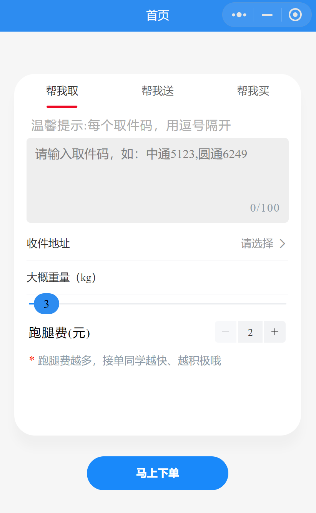
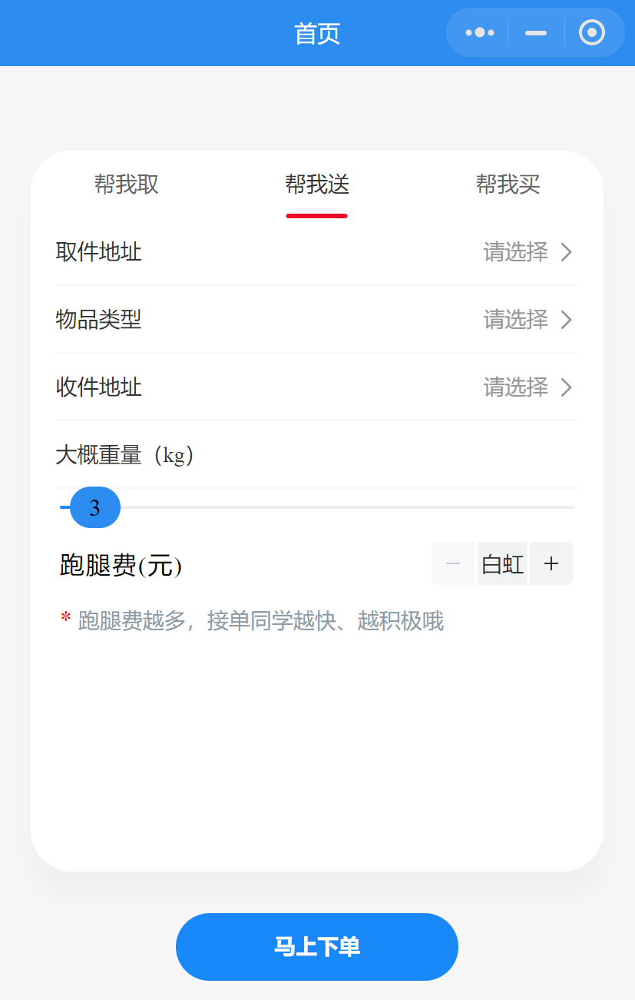
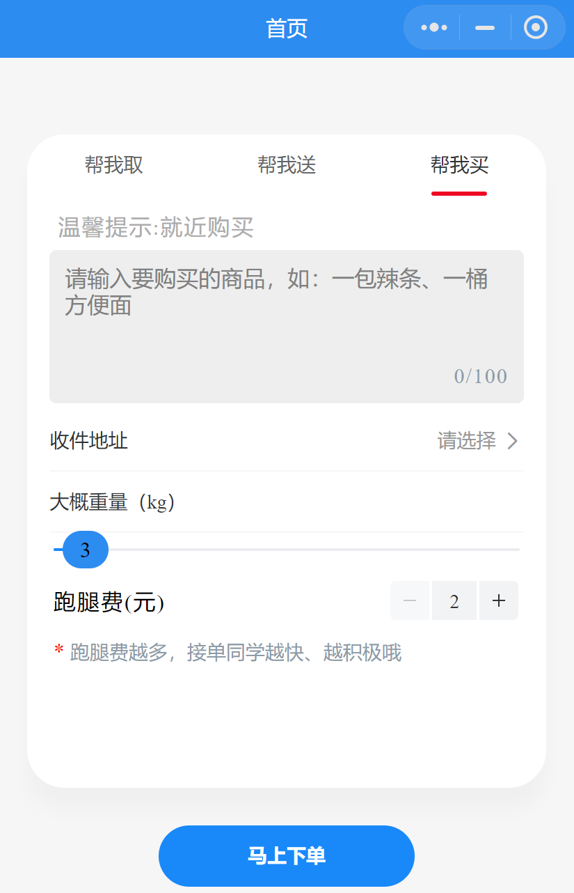
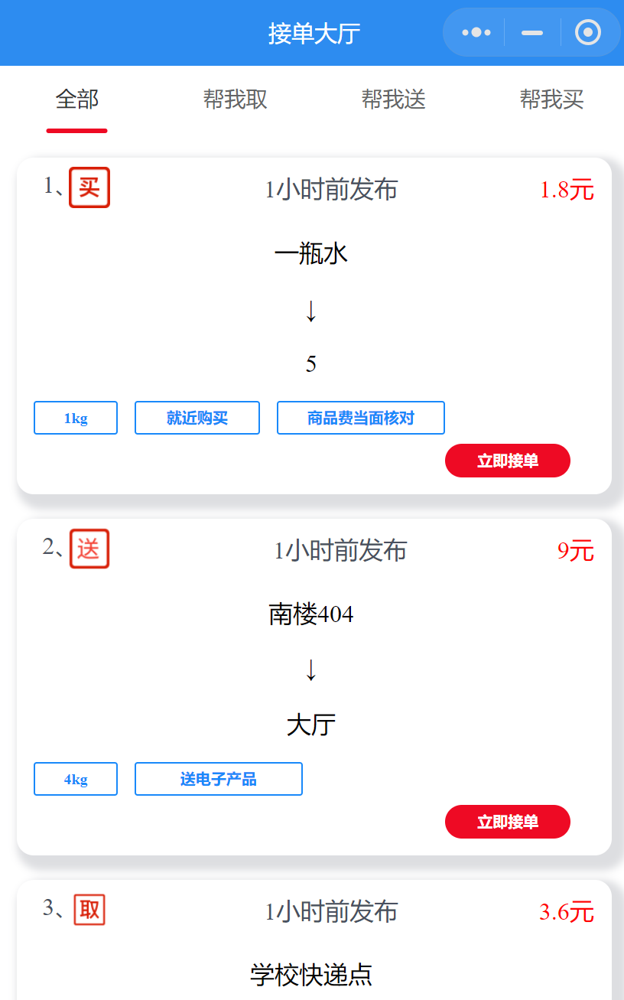
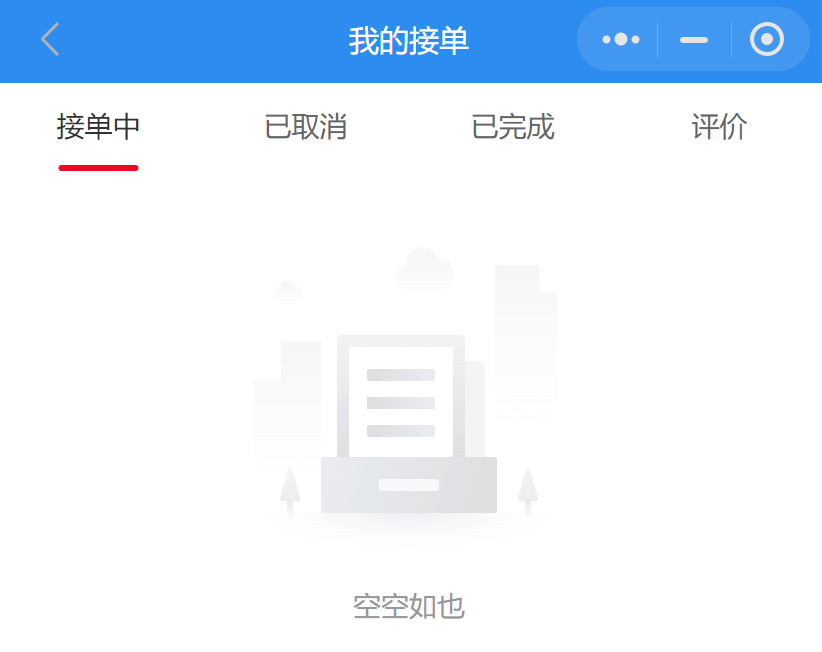
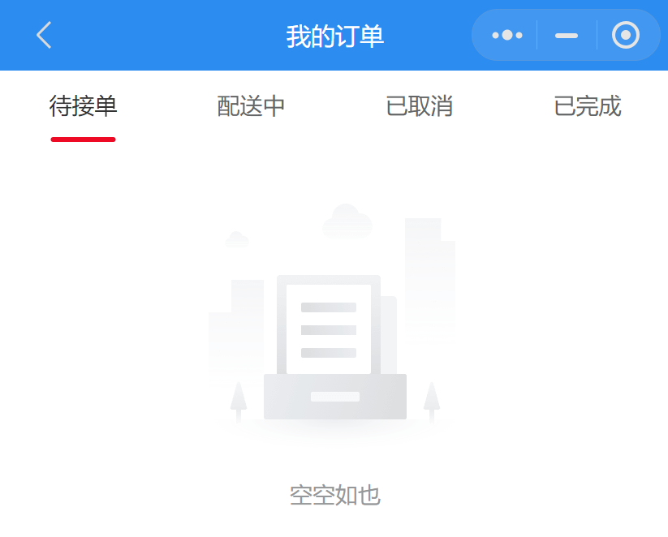
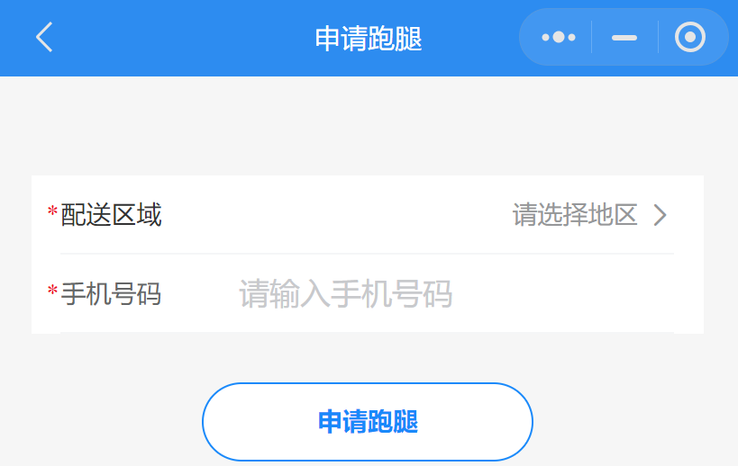
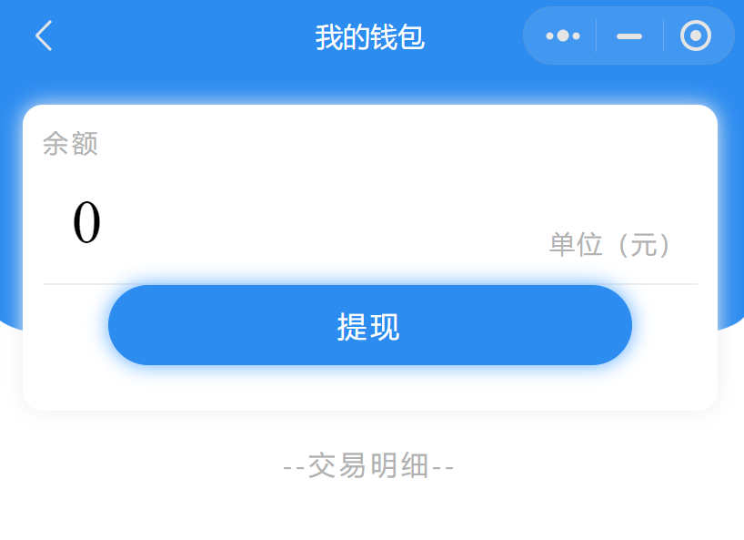
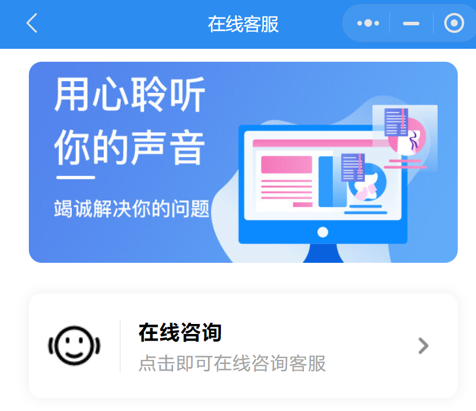
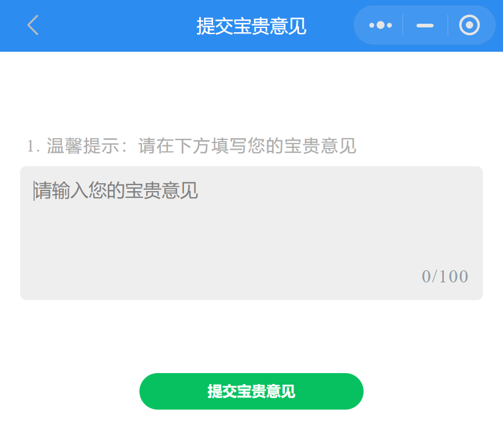

# User Manual for Nankai Errand Platform

## Overview

The Nankai Errand Platform is a convenient lifestyle service platform, offering a variety of errand services, including but not limited to package pickup, delivery, and shopping on behalf. Users simply need to provide the relevant information and place the order on our platform, then wait for the errand runner to accept the order to meet various daily needs.

## Key Features and Operation Guide

### Home Page

The home page is the core interface of our platform, including three main functional options, "Pickup for Me," "Delivery for Me," and "Buy for Me" to meet your different needs:

1. **Pickup for Me**: This feature is specially designed for package or takeout pickup. Please provide the pickup code(s) (if multiple, separated by commas), desired delivery address, estimated weight of the items, and the errand fee you are willing to pay. After completing the information, click submit to place the order and wait for the errand runner to accept it.

2. **Delivery for Me**: We also offer short-range delivery services, such as within the campus or nearby. Please provide the pickup address, item type, delivery address, estimated weight of the item, and the errand fee you're willing to pay. Once you've filled out this information, submit your order and wait for an errand runner to accept it.

3. **Buy for Me**: This is our shopping on behalf feature, helping you to buy needed items. Please provide detailed information about the item (such as name, brand, model, and specifications), as well as the delivery address, estimated weight of the item, and the errand fee you're willing to pay. After completing these steps, submit the order, and our errand runners will promptly purchase and deliver the items for you.

### Order Acceptance Hall

In the Order Acceptance Hall, we display all the order information published by users, which are categorized into "All," "Pickup for Me," "Delivery for Me," and "Buy for Me." Each order displays its errand fee, weight, detailed requirements, address, and the current status of the order.

### My Account

The "My Account" page is the user's personal center, which includes "My Accepted Orders," "My Orders," "Apply to Run Errands," "My Wallet," "Notifications," "Help Center," "Online Customer Service," and "Feedback":

1. **My Accepted Orders**: If you want to accept orders, you need to apply for errand running qualifications first. Our backend team will review your application, and once approved, you can accept orders.

2. **My Orders**: Here, you can check all your posted orders, including orders "Waiting for Acceptance," "In Delivery," "Cancelled," and "Completed."

3. **Apply to Run Errands**: If you wish to become an errand runner, you can select your convenient service area here, provide your mobile number, and submit an application. Our customer service team will review your application.

4. **My Wallet**: In this interface, you can check your account balance. You can use the balance to pay for orders, and the errand fee received after completing errand tasks will also be added to your balance. We support withdrawal of the balance.

5. **Notifications**: This page displays the information we push to all users, and you can click to view the details.

6. **Help Center**: If you encounter any issues during use, you can first look for answers in the Help Center, where a series of common questions are answered.

7. **Online Customer Service**: If you need more specific help, you can click to consult the online customer service. We will provide one-on-one service through WeChat conversation.

8. **Feedback**: We greatly appreciate your feedback to help us continue to improve our service.

After logging in and authorizing to display your avatar and nickname, you can enjoy all our services.

We look forward to providing you with convenient services. Welcome to use Nankai Errand Platform!
