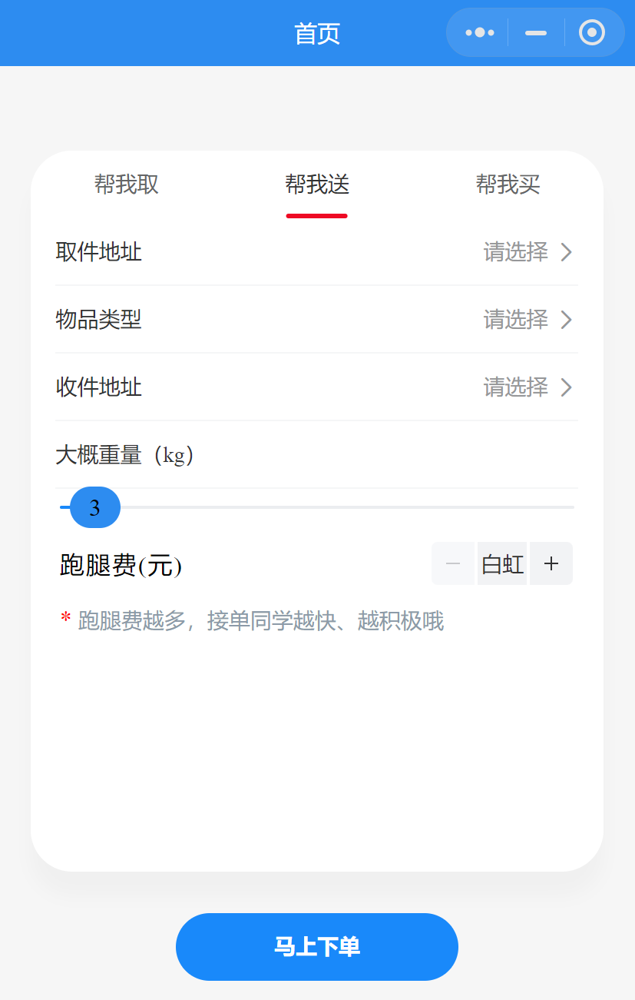
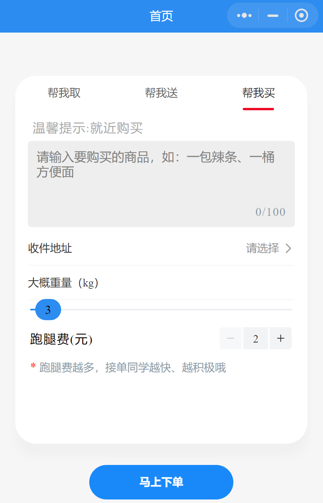
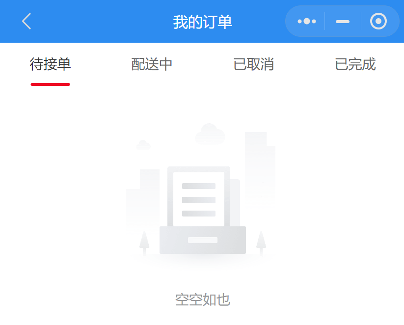
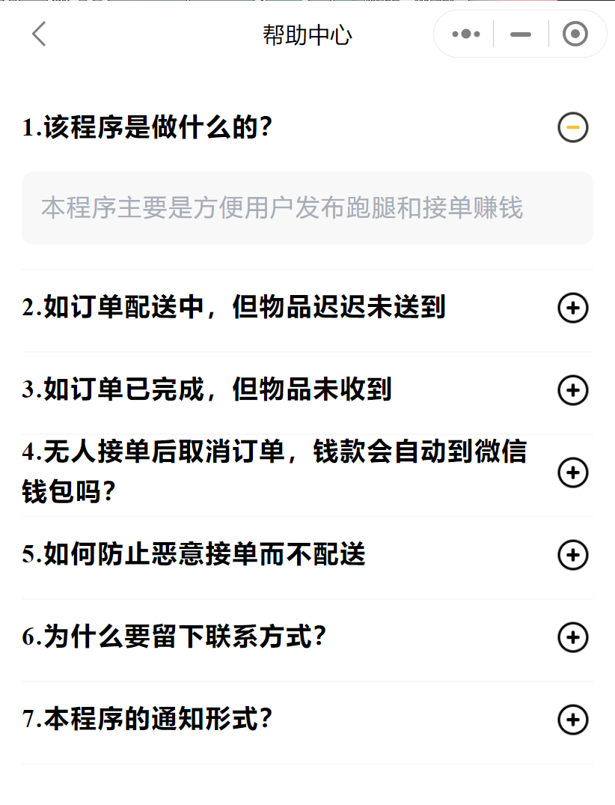

# 南科跑腿平台使用手册

## 概述

南科跑腿平台是一个便捷的生活服务平台，提供多种类型的跑腿服务，包括但不限于取快递、送物品和代购服务。用户只需在我们的平台上提供相应信息并发布订单，便可等待跑腿员接单，以满足各类日常需求。

## 主要功能及操作指南

### 首页

首页是我们平台的核心界面，包含“帮我取”、“帮我送”和“帮我买”三个主要功能选项，以满足您的不同需求：

1. **帮我取**：这是一个专为取快递或外卖而设的功能。请您在此处提供取件码（若有多个取件码，需以英文逗号分隔），并填写您期望的收货地址、预估的物品重量和您愿意支付的跑腿费。信息完善后，点击提交，订单即会发布，待跑腿员接单。
2. **帮我送**：我们还提供小范围的跑腿服务，如校园内或附近的配送。请您提供取件地址、物品类型、收货地址、预估的物品重量和您愿意支付的跑腿费。填写完毕，提交订单，等待跑腿员接单。
3. **帮我买**：这是我们的代购服务功能，帮助您购买所需的商品。请您提供商品的详细信息（如名称、品牌、型号和规格等），并填写收货地址、预估的物品重量和您愿意支付的跑腿费。完成以上步骤后，提交订单，我们的跑腿员将尽快为您购买并配送。

### 接单大厅

在接单大厅，我们展示了所有用户发布的订单信息，这些订单被分类为“全部”、“帮我取”、“帮我送”和“帮我买”。每个订单都会显示其跑腿费、重量、需求明细、地址和订单的当前状态等信息。

### 我的

“我的”页面是用户个人中心，它包括“我的接单”、“我的订单”、“申请跑腿”、“我的钱包”、“通知公告”、“帮助中心”、“在线客服”和“意见反馈”八个部分：

1. **我的接单**：如果您想尝试接单，您需要先申请获得跑腿资质，我们的后台团队将对您的申请进行审核，审核通过后，您即可接单。
2. **我的订单**：在这里，您可以查看所有发布过的订单，包括“待接单”、“配送中”、“已取消”和“已完成”的订单。
3. **申请跑腿**：若您希望成为跑腿员，可在此选择您方便服务的区域，填写手机号并提交申请，我们的客服团队将对您的申请进行审核。
4. **我的钱包**：在这个界面，您可以查看账户余额。您可以使用余额支付订单，也可以在完成跑腿任务后接收到的跑腿费。我们支持余额提现。
5. **通知公告**：此页面展示了我们向所有用户推送的信息，您可以点击查看详细内容。
6. **帮助中心**：如果您在使用过程中遇到问题，可以首先来帮助中心寻找答案，这里有一系列常见问题的解答。
7. **在线客服**：如果您需要更具体的帮助，可点击咨询在线客服，我们将通过微信会话为您提供一对一服务。
8. **意见反馈**：我们非常欢迎您提供意见反馈，以帮助我们持续改进我们的服务。

登录并授权展示头像和昵称后，您即可享受我们的各项服务。

我们期待为您提供便捷的服务，欢迎使用南科跑腿平台！
