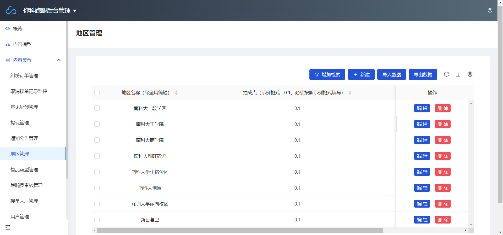
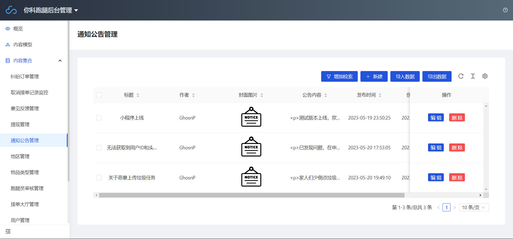
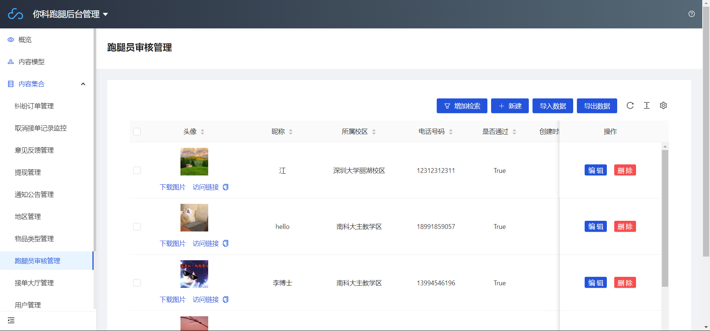
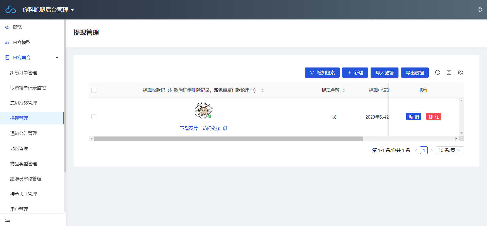

# 你科跑腿 · 开发者手册

**本项目遵从GPL开源协议，禁止商业用途，如遇到侵权行为，请与我反馈，多谢您的合作。**

## 内容列表

- [背景](#背景)
- [安装](#安装)
  - [开发环境安装](#开发环境安装)
  - [部署云开发](#部署云开发)
  - [部署云函数](#部署云函数)
  - [部署CMS控制后台](#部署CMS控制后台)
  - [接入微信支付](#接入微信支付)

- [使用说明](#使用说明)
  - [地区管理](#地区管理)
  - [通知公告管理](#通知公告管理)
  - [跑腿员审核管理](#跑腿员审核管理)
  - [提现管理](#提现管理)
- [相关仓库](#相关仓库)
- [维护者与文档编写](#维护者与文档编写)
- [如何贡献](#如何贡献)
- [使用许可](#使用许可)

## 背景

`你科跑腿` 项目运行在微信小程序平台，是目前手机终端的最流行的小程序平台，但由于微信小程序的协议众多、安装和部署环节繁琐，需要一个完备的报告来指导项目的部署和运行。本项目提供用户端和后台两个部分，采用微信官方提供的小程序IDE开发和环境配置。该微信小程序开发技术大概涉及微信支付、vant组件、腾讯地图sdk（实现定位、线路计算）、发送短信、推送微信订阅消息、云数据库（增删改查、事务、索引、聚合查询）、实时监听数据变化、flex页面布局、云函数等等 。

> 如果您希望使用微信支付的相关API及功能，您可能需要一张中华人民共和国政府认可的营业执照。

> 如果您不打算使用微信支付相关功能，则无需进行该项准备。

## 安装

### 开发环境安装

- 安装官方的[微信小程序开发平台](https://developers.weixin.qq.com/miniprogram/dev/devtools/download.html)（仅在Windows、Mac平台），建议安装STL版本。
- 进入[微信小程序平台](https://mp.weixin.qq.com)，注册账号，在“开发管理-开发设置”中获取您的**AppID**。
- 进入微信小程序开发平台，在后端服务中选择**小程序云开发**，使用获取到的**AppID**与本地仓库进行进行关联。

### 部署云开发

- 进入主界面，点击左上角的“**云开发**”按钮，进入云开发页面。
- 在云开发控制台中，点击右上角的“**设置**”按钮，进入环境设置页面。
- 新建或选择一个已有的云开发环境，获取您的**云环境ID**。
- 修改**app.js**和**app.json**中的云环境ID为您获取到的**云环境ID**。

```js
wx.cloud.init({env: '-----------------------'})
```

### 部署云函数

- 在**cloudfunctions**文件夹中，存放着所需要的云函数，每个云函数下都有index.js文件，更改每个**index.js**文件里面的env环境ID（index.js有这个env的都得更换，没有可以不换）
- 全部更换完成之后，点击右上角的“文件”，再点击“**保存文件**”。
- 右击**cloudfunctions**文件夹，查看当前环境是否已经有环境。如果没有，需要重新启动该项目（点击左上角的“项目”，再点击“重新打开此项目”）。
- 对于所有的云函数文件，右击所在的文件夹，再点击"上传并部署：云端安装依赖（不上传node_modules）"即可。

### 部署CMS控制后台

- 在微信开发者工具中，点击左上角的“**云开发**”，再点击“**更多**”，再点击“**内容管理**”，再点击“**开通**”，接着设置账号密码，等待5分钟左右开通完成。

- 开通完成后，访问地址并登录，点击“**创建新项目**”，项目名、项目ID可自定义，创建即可。
- 在内容模型中自定义需要的模型，对于前缀为“wx-ext”**以外**的数据库，修改权限为所有人可读，仅创建者可读写。
- 为了加速查询速度，您可以在“**云开发-数据库-索引管理**”中自定义建立索引。

### 接入微信支付

- 回到微信开发者工具，点击左上角的“**云开发**”，再点击右上角的“**设置**”，点击“**其他设置**”，再点击“**添加商户号**”，选择商户号。
- 添加后，系统会向商户管理员发送商户绑定及 JSAPI 授权请求。**请注意：一天仅能发起一次接入请求**。

## 使用说明

该部分主要介绍CMS控制后台的使用方法，请确保您**完全遵循**上述部署步骤进行了环境部署。

本项目提供了一个内容模型的示例版本，可以供您选择导入，以下使用说明将以项目中的内容模型进行说明。

### 地区管理

小程序的地址创建需要遵循规范，其中的必要项为地区，每一个地址应该对应一个地区，在地区管理中进行创建和维护。**请注意：出于美观考虑，请将地区名称设置的尽量简短**。



### 通知公告管理

开发者可以上传通知和公告，在通知公告管理项进行设置，采用富文本编辑器，提供多种样式的丰富文本编辑，同时需要发布一张公告图片。**请注意：请妥善选择通知图片，它可能会因为长度原因造成大小失真**。



### 跑腿员审核管理

用户可以提交申请注册成为跑腿员。在过去的旧版本中，期望接入公安系统，用户需要上传身份证信息。但在正式版中，因为安全原因放弃了该需求。用户只需提交ID、照片（头像）以及手机号即可。提交后由维护人员验证身份信息，确认无误后只需要修改“**是否通过**”为TRUE即可。



### 提现管理

跑腿员可以申请提现，申请时跑腿员会上传一张收款二维码，管理员在收到请求后，务必先验证打款账户与跑腿员账户信息是否一致，再进行打款。打款后请务必删除记录，避免给用户重复打款。



### 其他

对于其他的管理内容模型，均可以在CMS控制后台中操作。请注意：所有的操作是实时对云数据库的修改，对于垃圾信息和请求，平台目前没有很好的过滤功能，管理员需要核实后手动进行删除，以保证程序的良好使用环境。

## 相关仓库

- [wechatpay-postman-script](https://github.com/wechatpay-apiv3/wechatpay-postman-script) —  微信支付API v3 Postman官方脚本。
- [awesome-wechat-weapp](https://github.com/justjavac/awesome-wechat-weapp) — 微信小程序开发资源汇总。

## 维护者与文档编写

[@Kazawaryu](https://github.com/Kazawaryu)

## 如何贡献

非常欢迎你的加入！[提一个 Issue](https://github.com/Kazawaryu/Nike-Run-Errands-Wechat-Mini-Program/issues) 或者提交一个 Pull Request。

### 贡献者

感谢以下参与项目的人：

<a href="https://github.com/Kazawaryu/Nike-Run-Errands-Wechat-Mini-Program/graphs/contributors">
  
</a>

## 使用许可

[GNU GENERAL PUBLIC LICENSE](https://www.gnu.org/licenses/gpl-3.0.html) © Ghosn P
