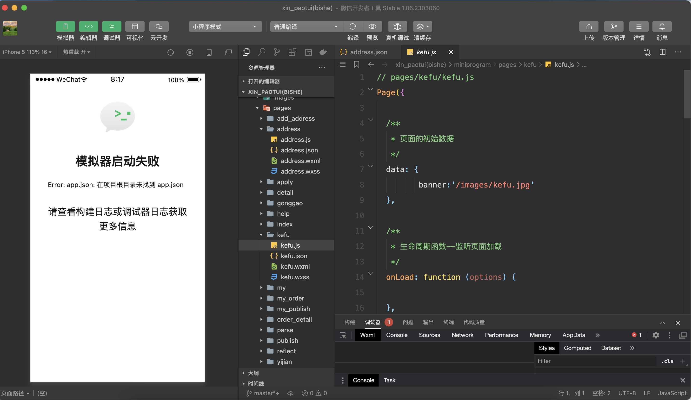

### 1.3 Tests

The development of  school errand weichat mini program platform is based on manual testing. As the WeChat mini program development tool has provided **simulator functions, debugger and real machine testing functions**, it is very convenient to manually test the project function.

Here are two test cases that show how we put the project to the test. The following testing case uses the real machine debugging function, that is, by opening the real machine debugging button, a short-term effective Mini Program QR code will be generated, and the function test will be carried out on your mobile phone by scanning the QR code.

**Case 1:** Test the "Buy for me" function

* First go to the home page and select the "Help Me Buy" interface;
* After filling in the purchase information, delivery address, approximate weight and errand fee, click offer Order;
* Test whether the "Help Me Buy" order that has just been issued appears in the order receiving hall;
* Test whether the "Help Me Buy" order just released appears in the background management interface;

**Case 2:** Test the order receiving function

* First, after you have registered as an errand runner, enter the order receiving hall and randomly select an order to receive an order;
* Go to "My Orders", check "Order Details" and contact the receiving information respectively, then finally confirm the delivery;
* Test whether the order that has just been completed is displayed in the "Completed" interface;
* Re-enter as the order user to test whether the order is in the "completed" state;
* Enter the background management interface to observe whether the order status is as expected;